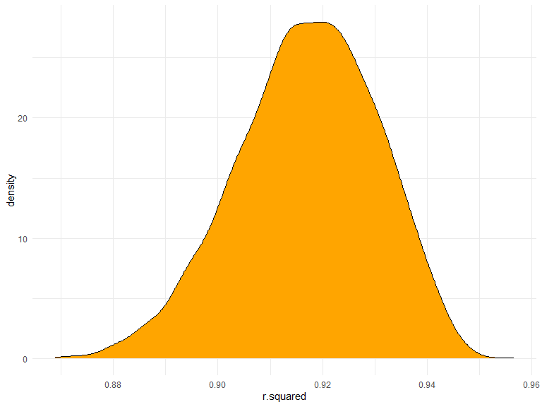
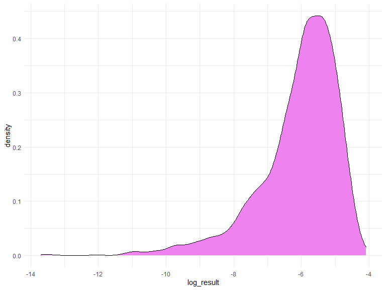
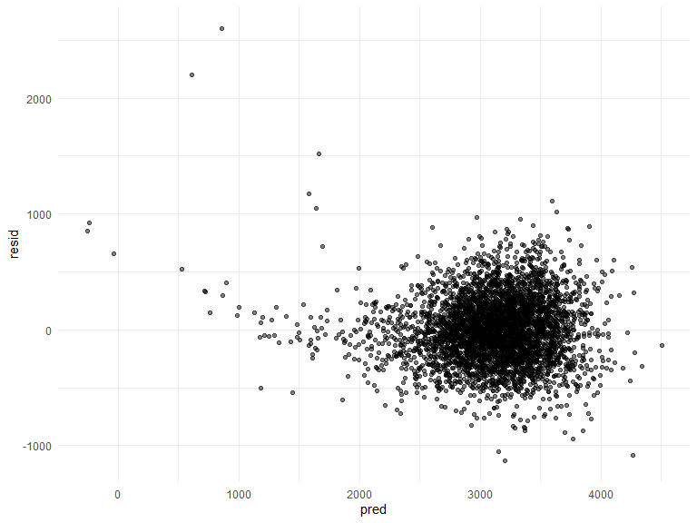
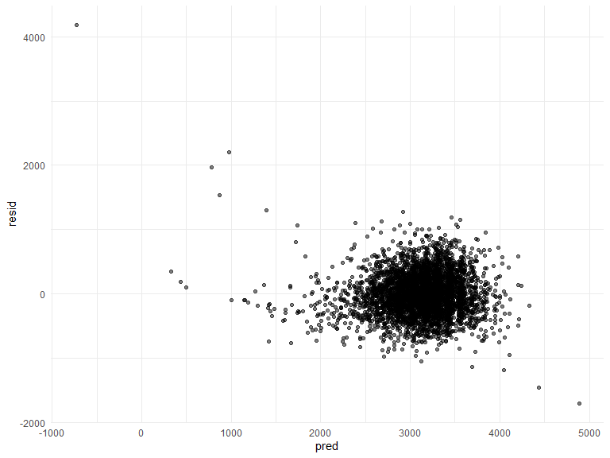
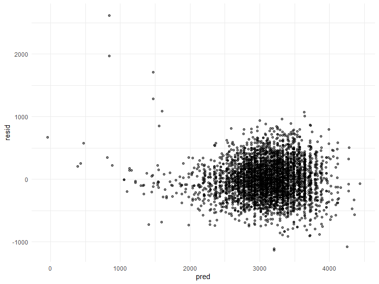
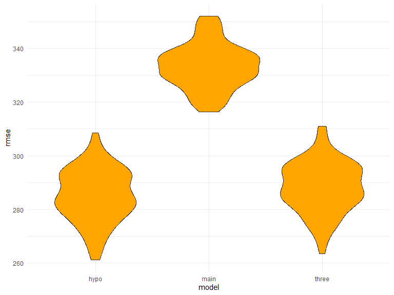

p8105_hw6_bh2852
================
Beicheng Huang
2023-12-03

\##Q1 Skip

\##Q2

Weather data

``` r
weather_df = 
  rnoaa::meteo_pull_monitors(
    c("USW00094728"),
    var = c("PRCP", "TMIN", "TMAX"), 
    date_min = "2022-01-01",
    date_max = "2022-12-31") |>
  mutate(
    name = recode(id, USW00094728 = "CentralPark_NY"),
    tmin = tmin / 10,
    tmax = tmax / 10) |>
  select(name, id, everything())
```

    ## using cached file: C:\Users\12390\AppData\Local/R/cache/R/rnoaa/noaa_ghcnd/USW00094728.dly

    ## date created (size, mb): 2023-12-02 21:29:03.790516 (8.561)

    ## file min/max dates: 1869-01-01 / 2023-11-30

Set up Bootstrap samples

``` r
boot_straps = 
  weather_df |>
  modelr::bootstrap(n = 5000) |>
  mutate(
    models = map(strap, \(df) lm(tmax ~ tmin + prcp, data = df)),
    results_1 = map(models, broom::tidy),
    results_2 = map(models, broom::glance)) |>
  select(-strap, -models)
```

\###Estimating r2

``` r
r2 = 
  boot_straps |>
  select(-results_1) |>
  unnest(results_2) |>
  select(.id, r.squared)
```

Plot the distribution of your estimates (r^2)

``` r
r2 |> 
  ggplot(aes(x = r.squared)) + geom_density(fill = "orange")
```



Calculating 2.5% and 97.5% quantiles of r2, thus estimating 95%CI.

``` r
lowerq_r2 <- quantile(r2$r.squared, 0.025)

upperq_r2 <- quantile(r2$r.squared, 0.975)

confidence_interval_r2 <- c(lowerq_r2, upperq_r2)

confidence_interval_r2
```

    ##      2.5%     97.5% 
    ## 0.8888660 0.9408734

The estimated 2.5% quantile is 0.888 and 97.5% quantile is 0.941, thus
the 95%CI is (0.888, 0.941)

\###Estimating log(β<sup>1∗β</sup>2)

``` r
logbeta = 
  boot_straps |>
  select(-results_2) |>
  unnest(results_1) |>
  select(.id, term, estimate) |>
  mutate(term = ifelse(term == "tmin", "b1", ifelse(term == "prcp", "b2", term))) |>
  pivot_wider(names_from = term, values_from = estimate) |>
  mutate(log_result = log(b1 * b2))
```

Plot the distribution of your estimates log(β<sup>1∗β</sup>2)

``` r
logbeta |> 
  ggplot(aes(x = log_result)) + geom_density(fill = "violet")
```



According to the plot, it is a left-skewed distribution.

Calculating 2.5% and 97.5% quantiles of log(β<sup>1∗β</sup>2), thus
estimating 95%CI for log(β<sup>1∗β</sup>2)

``` r
lowerq_log <- quantile(logbeta$log_result, 0.025, na.rm = TRUE)

upperq_log <- quantile(logbeta$log_result, 0.975, na.rm = TRUE)

confidence_interval_log <- c(lowerq_log, upperq_log)

confidence_interval_log
```

    ##      2.5%     97.5% 
    ## -9.226569 -4.575776

2.5% and 97.5% quantiles for log(β<sup>1∗β</sup>2) respectively are
-9.069 and -4.593.Thus the 95% CI are (-9.069, -4.593).

\##Q3

Load and clean the birthweight.csv datafile.

``` r
birthweight_df = 
  read_csv("birthweight.csv") |>
  janitor::clean_names() |>
  drop_na() |>
  mutate(babysex = as.factor(babysex),
         frace = case_when(frace == 1 ~ "White",
                           frace == 2 ~ "Black",
                           frace == 3 ~ "Asian",
                           frace == 4 ~ "Puerto",
                           frace == 8 ~ "Other",
                           frace == 9 ~ "Unknown"),
         frace = as.factor(frace),
         malform = as.factor(malform),
         mrace = case_when(mrace == 1 ~ "White",
                           mrace == 2 ~ "Black",
                           mrace == 3 ~ "Asian",
                           mrace == 4 ~ "Puerto Rican",
                           mrace == 8 ~ "Other"),
         mrace = as.factor(mrace))
```

    ## Rows: 4342 Columns: 20
    ## ── Column specification ────────────────────────────────────────────────────────
    ## Delimiter: ","
    ## dbl (20): babysex, bhead, blength, bwt, delwt, fincome, frace, gaweeks, malf...
    ## 
    ## ℹ Use `spec()` to retrieve the full column specification for this data.
    ## ℹ Specify the column types or set `show_col_types = FALSE` to quiet this message.

Hypothesis of linear regression model for birth weight.

``` r
hypothesis = lm(bwt ~ babysex + bhead + blength + gaweeks + momage, data = birthweight_df)
```

Plotting the model residuals against fitted values.

``` r
birthweight_df |>
  add_predictions(hypothesis) |>
  add_residuals(hypothesis) |>
  ggplot(aes(x = pred, y = resid)) + geom_point(alpha = 0.5)
```



Compare the model to two other models

``` r
main_effect_model = lm(bwt ~ blength + gaweeks, data = birthweight_df)
three_way_interaction = lm(bwt ~ babysex + bhead + blength + babysex*bhead + babysex*blength + bhead*blength + babysex*bhead*blength, data = birthweight_df)
```

Modeling residual against fitted values for main effect model and three
way interaction model.

``` r
birthweight_df |>
  add_predictions(main_effect_model) |>
  add_residuals(main_effect_model) |>
  ggplot(aes(x = pred, y = resid)) + geom_point(alpha = 0.5)
```



``` r
birthweight_df |>
  add_predictions(three_way_interaction) |>
  add_residuals(three_way_interaction) |>
  ggplot(aes(x = pred, y = resid)) + geom_point(alpha = 0.5)
```



Testing using cross-validation

Generate training and testing datasets

``` r
cv_df = 
  crossv_mc(birthweight_df, 100) |>
 mutate(
    train = map(train, as_tibble),
    test = map(test, as_tibble))
```

Fit the model and obtain RMSEs using mutate and map&map2

``` r
cv_df = 
  cv_df |> mutate(
    hypothesis  = map(train, \(df) lm(bwt ~ babysex + bhead + blength + gaweeks + momage, data = birthweight_df)),
    main_effect_model = map(train, \(df) lm(bwt ~ bhead + gaweeks, data = df)),
    three_way_interaction = map(train, \(df) lm(bwt ~ babysex + bhead + blength + babysex*bhead + babysex*blength + bhead*blength + babysex*bhead*blength, data = birthweight_df)))|> 
  mutate(
    rmse_hypo = map2_dbl(hypothesis, test, \(mod, df) rmse(model = mod, data = df)),
    rmse_main = map2_dbl(main_effect_model, test, \(mod, df) rmse(model = mod, data = df)),
    rmse_three = map2_dbl(three_way_interaction, test, \(mod, df) rmse(model = mod, data = df)))
```

Plot the prediction error for hypothesis, main effect, and three way
interaction models.

``` r
cv_df |> 
  select(starts_with("rmse")) |> 
  pivot_longer(
    everything(),
    names_to = "model", 
    values_to = "rmse",
    names_prefix = "rmse_") |> 
  mutate(model = fct_inorder(model)) |> 
  ggplot(aes(x = model, y = rmse)) + geom_violin(fill = "orange")
```



According to the graph, the hypothesis model which includes babysex +
bhead + blength + gaweeks + momage as variables against birthweight
seems to be the most appropriate model due to its lowest prediction
error distribution. The three way interaction seems to be reasonable as
well, while the main effect model has the largest prediction error
distribution.
